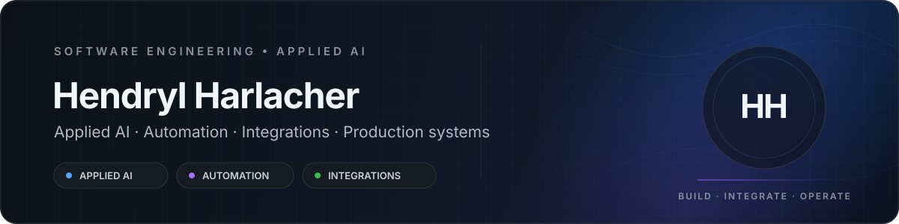

 

[Português](./README.md) · **English**

 

&nbsp;

## About

Software Engineer focused on **applied AI, enterprise automation, and systems integration**. I build solutions that connect language models, APIs, legacy systems, data, and web interfaces — from architecture decisions and implementation to deployment, monitoring, and production evolution.

My work combines **software engineering, generative AI, and automation** to turn complex operational processes into systems that are traceable, resilient, and practical in day-to-day use.

---

## Featured projects

<table>
<tr>
<td width="50%" valign="top">

### [ArchSmith](https://github.com/HendrylHH/archsmith)

A **local-first** engineering memory and MCP server for cataloging, approving, versioning, and reusing functions.

**Highlights:** Python · MCP · SQLite · versioning · security · code reuse

</td>
<td width="50%" valign="top">

### [IA na Prática](https://github.com/HendrylHH/ianapratica)

A content and web product focused on the practical application of artificial intelligence.

**Highlights:** web product · AI · technical content · user experience

</td>
</tr>
</table>

---

## Core stack

  

---

## Areas of expertise

| | |
| --- | --- |
| **Applied AI** | LLMs, RAG, embeddings, agents, MCP, evaluation, and AI security |
| **Automation** | RPA, batch processing, resumability, traceability, and failure handling |
| **Backend & integrations** | REST APIs, Java, Python, services, and enterprise systems integration |
| **Frontend & products** | TypeScript, React, and web applications designed around real workflows |
| **Data** | SQL, data processing, Power BI, and operational metrics |
| **Operations** | deployment, monitoring, observability, and operational continuity |

---

## Portfolio

**[Artificial Intelligence](./portfolio/inteligencia-artificial/README.md)** · **[Frontend & Products](./portfolio/frontend-e-produtos/README.md)**

The public projects presented here are independent from professional materials subject to confidentiality.
