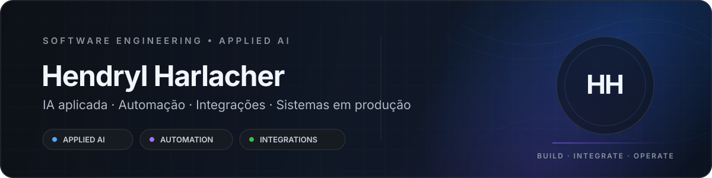

 

&nbsp;

## Sobre

Engenheiro de Software com foco em **IA aplicada, automação corporativa e integração de sistemas**. Desenvolvo soluções que conectam modelos de linguagem, APIs, sistemas legados, dados e interfaces web — da definição da arquitetura à implantação, monitoramento e evolução em produção.

Meu trabalho combina **engenharia de software, IA generativa e automação** para transformar processos complexos em sistemas rastreáveis, resilientes e utilizáveis no dia a dia.

---

## Projetos em destaque

<table>
<tr>
<td width="50%" valign="top">

### [ArchSmith](https://github.com/HendrylHH/archsmith)

Memória de engenharia **local-first** e servidor MCP para catalogar, aprovar, versionar e reutilizar funções.

**Destaques:** Python · MCP · SQLite · versionamento · segurança · reutilização de código

</td>
<td width="50%" valign="top">

### [IA na Prática](https://github.com/HendrylHH/ianapratica)

Projeto de conteúdo e produto web voltado à aplicação prática de inteligência artificial.

**Destaques:** produto web · IA · conteúdo técnico · experiência de usuário

</td>
</tr>
</table>

---

## Stack principal

  

---

## Áreas de atuação

| | |
| --- | --- |
| **IA aplicada** | LLMs, RAG, embeddings, agentes, MCP, avaliação e segurança |
| **Automação** | RPA, processamento em lote, retomada, rastreabilidade e tratamento de falhas |
| **Backend & integrações** | APIs REST, Java, Python, serviços e integração com sistemas corporativos |
| **Frontend & produtos** | TypeScript, React e aplicações web orientadas a fluxos reais |
| **Dados** | SQL, processamento de dados, Power BI e indicadores operacionais |
| **Operação** | implantação, monitoramento, observabilidade e continuidade operacional |

---

## Portfólio

**[Inteligência Artificial](./portfolio/inteligencia-artificial/README.md)** · **[Frontend e Produtos](./portfolio/frontend-e-produtos/README.md)**

Os projetos públicos apresentados aqui são independentes de materiais profissionais sujeitos a confidencialidade.
